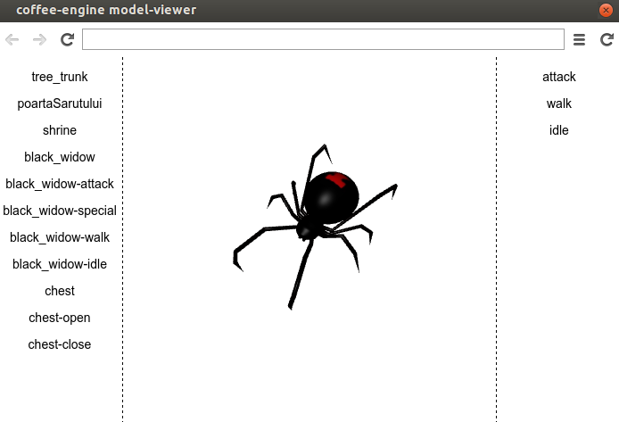

coffee-engine
=============

* 3d engine ~ thin layer over three.js in coffeescript
* 2d engine
* 3d model-viewer (built with nw.js)

Helpful commands
----------------

```
grunt dev
```

```
grunt doc
```

```
grunt release # compiles files for release
```

```
./release.rb # requires ruby
```

model-viewer
------------

```
cd model-viewer/
./model-viewer
```


